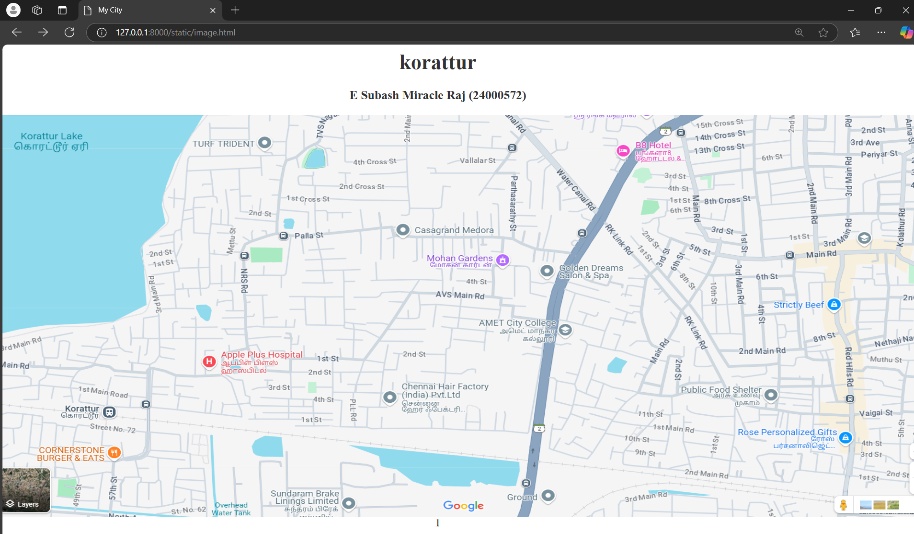

# Ex04 Places Around Me
# Date:12-12-2024
# AIM
To develop a website to display details about the places around my house.

# DESIGN STEPS
## STEP 1
Create a Django admin interface.

## STEP 2
Download your city map from Google.

## STEP 3
Using <map> tag name the map.

## STEP 4
Create clickable regions in the image using <area> tag.

## STEP 5
Write HTML programs for all the regions identified.

## STEP 6
Execute the programs and publish them.

# CODE
```
image.html

<html>
<head>
<title>My City</title>
</head>
<body>
<h1 align="center">
<font color="#333"><b>korattur</b></font>
</h1>
<h3 align="center">
<font color="#333"><b>E Subash Miracle Raj (24000572)</b></font>
</h3>
<center>

<map name="MyCity">
    <area target="" alt="busstand" title="busstand" href="busstand.html" coords="150,450,605,606" shape="rect">
    <area target="" alt="hospital" title="hospital" href="hospital.html" coords="300,200,600,400" shape="rect">1
    <area target="" alt="lake" title="lake" href="lake.html" coords="50,1,90,330" shape="rect">
    <area target="" alt="B8 Hotel" title="B8 Hotel" href="b8hotel.html" coords="940,25,1700,35" shape="rect">
    <area target="" alt="temple" title="temple" href="temple.html" coords="250,100,500,239" shape="rect">
</map>
</center>
</body>
</html>

busstand.html

<html>
<head>
<title>My Home Town</title>
</head>
<body bgcolor="#333">
<h1 align="center">
<font color="white"><b>korattur</b></font>    
</h1>
<h3 align="center">
<font color="white"><b>KORATTUR BUS STAND</b></font>    
</h3>
<hr size="3" color="white">
<p align="justify">
<font face="Georgia" size="5" color="white">
    Korattur Bus Stand is a prominent transportation hub located in the northwestern part of Chennai, Tamil Nadu, India. It serves as a key point for commuters traveling to and from various parts of Chennai and surrounding areas. The bus stand is well-connected by multiple bus routes, making it an essential transit location for both local residents and visitors.
    The bus stand is well-connected to various parts of Chennai, making it an important transit point for daily commuters, especially those traveling from the northern suburbs to the city center or other important locations. It offers buses operated by the Metropolitan Transport Corporation (MTC), which serve routes within Chennai and extend to nearby towns.<br>

In addition to its role as a public transport terminal, the Korattur Bus Stand is located in a region with a mix of residential, commercial, and industrial developments, contributing to its high foot traffic and importance in local commuting. The stand's strategic location makes it a vital part of the daily transportation infrastructure for residents and workers in the area.

 </font>
 </p>      
</body>
</html>

hospital.html

<html>
<head>
<title>My Home Town</title>
</head>
<body bgcolor="#333">
<h1 align="center">
<font color="white"><b>korattur</b></font>    
</h1>
<h3 align="center">
<font color="white"><b>HOSPITAL</b></font>    
</h3>
<hr size="3" color="white">
<p align="justify">
<font face="Georgia" size="5" color="white">
    Apple Plus Hospital is a healthcare facility located in Korattur, Chennai, Tamil Nadu. The hospital provides a range of medical services to the local community, focusing on delivering quality care in a variety of specialties. Though specific details may vary, hospitals like Apple Plus typically offer services such as:

General Medicine
Surgical Services
Emergency Care
Pediatrics
Maternity and Obstetrics
Orthopedics
Diagnostic Services (e.g., lab tests, imaging like X-rays and ultrasounds)
Apple Plus Hospital caters to both outpatient and inpatient needs, aiming to provide accessible healthcare to the residents of Korattur and nearby areas. It may also feature modern medical equipment and a team of experienced doctors, nurses, and healthcare professionals focused on providing effective treatment and patient care.

Given its location in the growing northern suburbs of Chennai, the hospital serves as an important healthcare provider, particularly for individuals seeking reliable medical care without needing to travel far from their homes.

</font>
 </p>      
</body>
</html>

lake.html

<html>
<head>
<title>My Home Town</title>
</head>
<body bgcolor="#333">
<h1 align="center">
<font color="white"><b>KORATTUR</b></font>    
</h1>
<h3 align="center">
<font color="white"><b> KORATTUR LAKE</b></font>    
</h3>
<hr size="3" color="blue">
<p align="justify">
<font face="Georgia" size="5" color="white">
    Korattur Lake is a significant water body located in the Korattur area of Chennai, Tamil Nadu. The lake is a vital part of the local ecosystem and serves as an important natural resource for the region. Covering a substantial area, Korattur Lake is surrounded by residential areas, making it an integral part of the community, offering both aesthetic and environmental value.

    Historically, Korattur Lake was an irrigation tank and played an important role in the region's water management system. Over time, it has become a hub for biodiversity, supporting various species of birds, plants, and aquatic life. The lake also helps in flood control by acting as a natural catchment area during the monsoon season.

    Historically, the lake had been a significant feature for local biodiversity and was used for agricultural and recreational purposes. Over time, it faced pollution and encroachment issues, like many urban lakes in Chennai, due to rapid urbanization and industrial development. In recent years, efforts have been made to rejuvenate and conserve the lake to improve water quality, enhance biodiversity, and prevent further encroachment.
 </font>
 </p>      
</body>
</html>

b8hotel.html

<html>
<head>
<title>My Home Town</title>
</head>
<body bgcolor="#333">
<h1 align="center">
<font color="white"><b>korattur</b></font>    
</h1>
<h3 align="center">
<font color="white"><b>B8 HOTEL</b></font>    
</h3>
<hr size="3" color="white">
<p align="justify">
<font face="Georgia" size="5" color="white">
    Welcome to B8 Hotel, where comfort, style, and convenience come together to offer you a memorable stay.
    Nestled in a prime location, B8 Hotel provides an ideal retreat for both business and leisure travelers. With its modern design, top-tier amenities, and exceptional service, B8 Hotel creates a perfect home away from home. Whether you're enjoying a relaxing vacation or attending an important event, our friendly staff and thoughtfully designed spaces ensure your experience is seamless and enjoyable.
    Experience the perfect blend of luxury and affordability at B8 Hotel—your ultimate destination for comfort and relaxation.<br>
    Historically, the lake had been a significant feature for local biodiversity and was used for agricultural and recreational purposes. Over time, it faced pollution and encroachment issues, like many urban lakes in Chennai, due to rapid urbanization and industrial development. In recent years, efforts have been made to rejuvenate and conserve the lake to improve water quality, enhance biodiversity, and prevent further encroachment.
</font>
 </p>      
</body>
</html>

temple.html

<html>
<head>
<title>My Home Town</title>
</head>
<body bgcolor="#333">
<h1 align="center">
<font color="white"><b>KORATTUR</b></font>    
</h1>
<h3 align="center">
<font color="white"><b>TEMPLE</b></font>    
</h3>
<hr size="3" color="blue">
<p align="justify">
<font face="Georgia" size="5" color="white">
    Korattur Perumal Koil is an ancient and revered Hindu temple located in the Korattur area of Chennai, Tamil Nadu. Dedicated to Lord Vishnu, the temple is also known as a Vaishnavite temple and is one of the significant places of worship in the locality. The temple's full name is often referred to as Sri Korattur Perumal Temple.
    <br>
    Deity: The main deity of the temple is Lord Lakshmi Narayana, who is worshiped in the form of a grand idol. Devotees seek blessings for prosperity, health, and spiritual well-being.

Architecture: The temple follows traditional South Indian architectural style, featuring intricate sculptures and carvings that depict various Hindu deities and mythological stories.

Festivals: Like many other Vishnu temples, the temple celebrates major Hindu festivals such as Vaikunta Ekadasi, Rathasapthami, and Pongal with great enthusiasm. The annual festivals attract a large number of devotees, who participate in special prayers, processions, and rituals.

Religious Services: The temple offers daily prayers, special pujas, and homams. Devotees also come for various religious ceremonies like Vedic chanting, abhishekam, and thulasi archana.

Korattur Perumal Koil is not just a place of worship but also a cultural hub where locals gather for religious and community events. Its peaceful environment and sacred atmosphere make it an important part of the religious landscape in the northern suburbs of Chennai.
      
 </font>
 </p>      
</body>
</html>

```
# OUTPUT



# RESULT
The program for implementing image maps using HTML is executed successfully.
